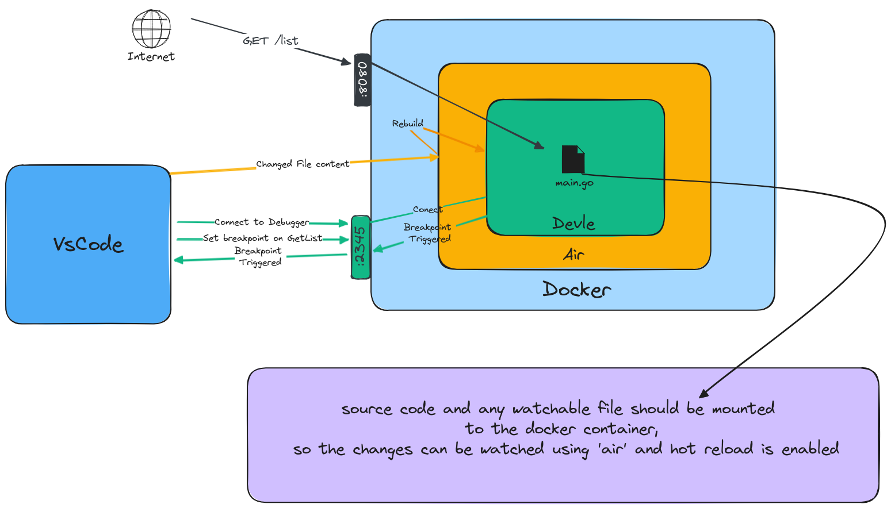

# VS Code Go Debugger With Docker

This is a simple example of how to use the attach VS Code debugger to a running Go program with hot reload in a Docker container.

## How Does It Work?
This example uses [Air](https://github.com/air-verse/air) for hot reload, by watching for changes in the code and restarting the server. 
And uses [Delve](github.com/go-delve/delve/cmd/dlv) for debugging, by attaching to the running process and setting breakpoints.




## Setup
1. Run the server inside a docker container, and mount the code to `app/` folder inside the container.
2. Expose the server port `8080` to the host.
3. Expose the delve port `2345` to the host.
4. configure vscode to attach to the delve server.
    ```json
    {
        "configurations": [
            {
                "name": "Attach to Go in Docker",
                "type": "go",
                "request": "attach",
                "mode": "remote",
                "remotePath": "/app",  // Path to your app inside the container
                "port": 2345,
                "host": "127.0.0.1",   // Or the Docker container's IP address if running on a remote server
                "apiVersion": 2,
                "trace": "log",        // Optional: enables logging for debugging issues with Delve
                "showLog": true        // Optional: shows logs in the output console
            }
            
        ]
    }
    ```

5. Start the debugger in VS Code and make a change in the code to see the hot reload in action.