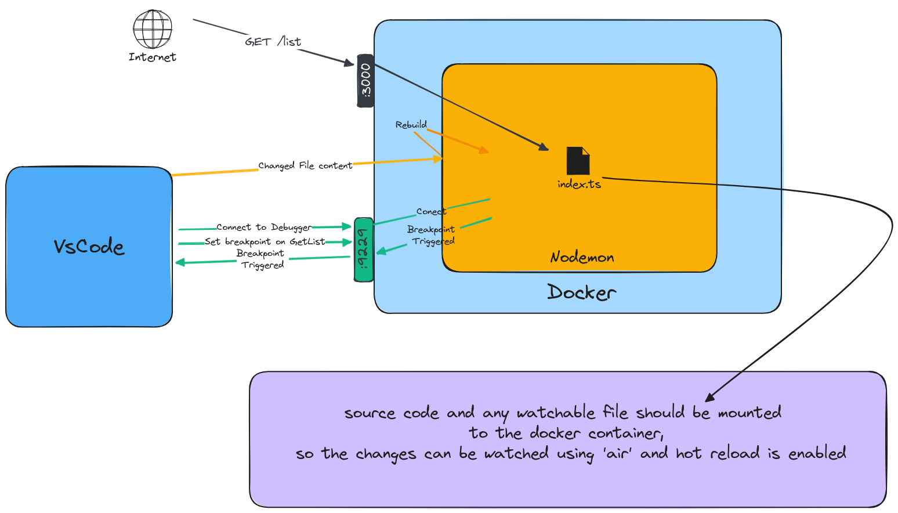

# VS Code Node Debugger With Docker

This is a simple example of how to use the attach VS Code debugger to a running Node program with hot reload in a Docker container.

## How Does It Work?
This example uses [Nodemon](https://github.com/remy/nodemon) for hot reload, by watching for changes in the code and restarting the server,
and for debugging, by attaching to the running process and setting breakpoints.




## Setup
1. Run the server inside a docker container, and mount the code to `app/` folder inside the container.
2. Expose the server port `3000` to the host.
3. Expose the delve port `9229` to the host.
4. configure vscode to attach to the delve server.
    ```json
    {
        "version": "0.2.0",
        "configurations": [
            {
                "name": "Attach to Node.js",
                "type": "node",
                "request": "attach",
                "port": 9229,
                "restart": true,
                "localRoot": "${workspaceFolder}", // Map to your local project folder
                "remoteRoot": "/app", // Map to the path inside the container
            }
        ]
    }
    ```
    


5. Start the debugger in VS Code and make a change in the code to see the hot reload in action.